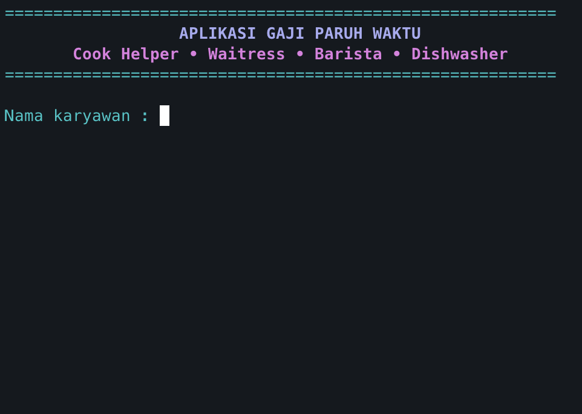
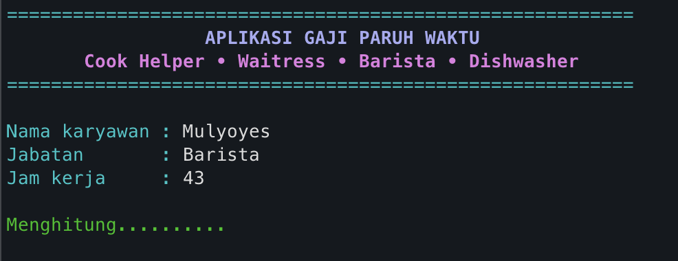
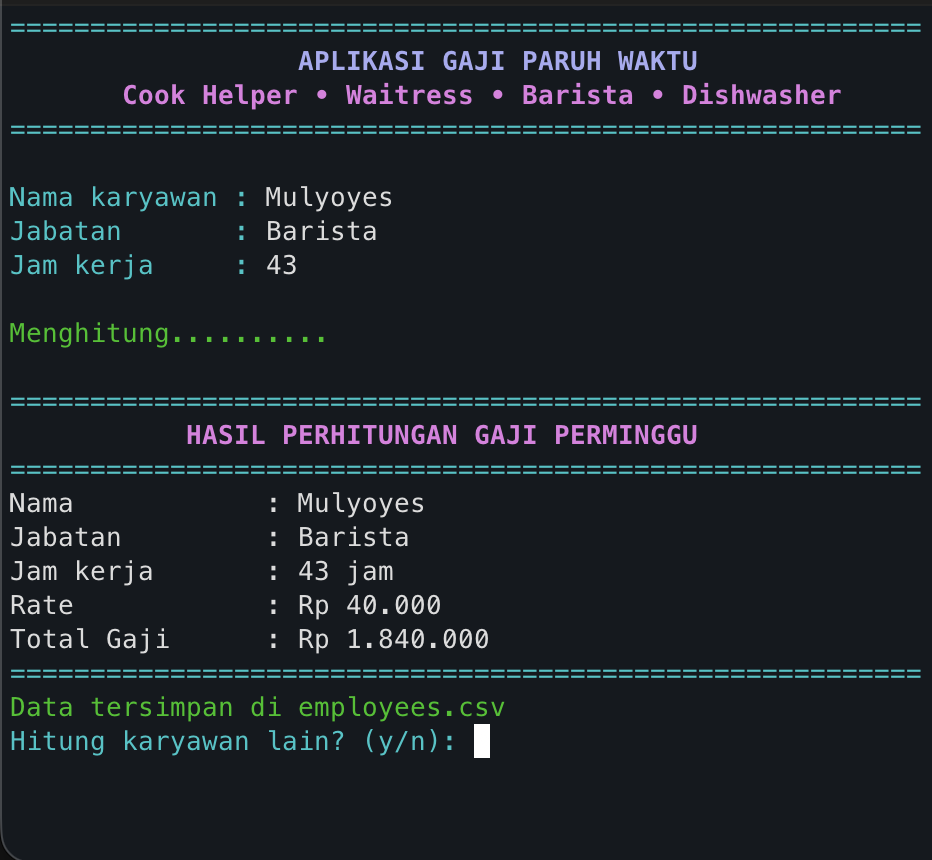
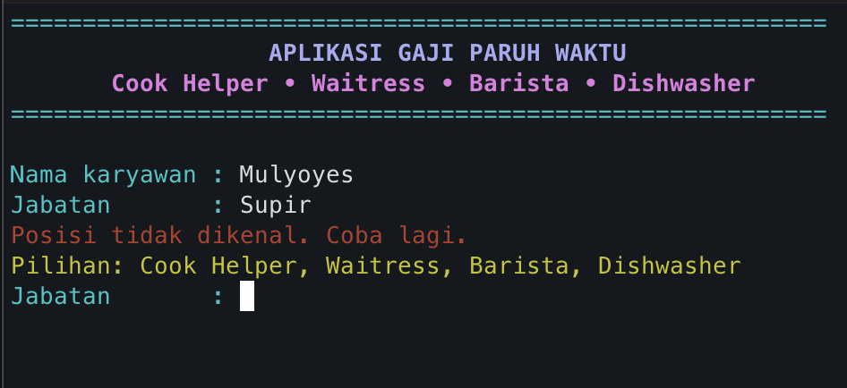
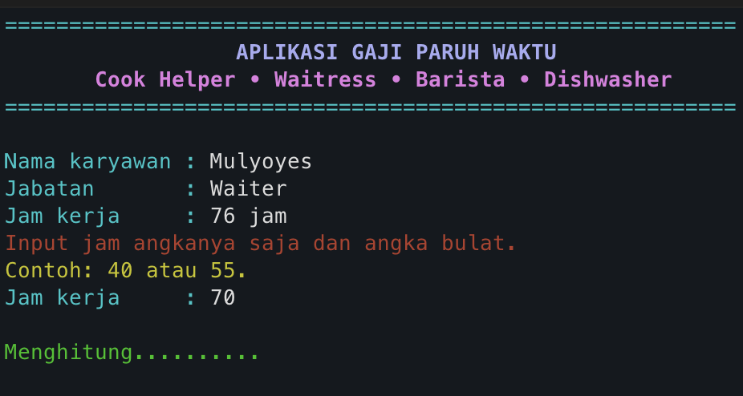

# Aplikasi Gaji Paruh Waktu

Aplikasi berbasis Bash untuk menghitung gaji karyawan paruh waktu secara sederhana.  
Mendukung validasi input, perhitungan lembur, tampilan terminal berwarna, dan penyimpanan data otomatis ke file.

## Fitur
- Input nama karyawan.
- Validasi posisi dengan daftar posisi yang tersedia.
- Validasi jam kerja untuk angka bulat.
- Perhitungan lembur untuk jam kerja lebih dari 40 jam.
- Tampilan terminal berwarna untuk memudahkan pembacaan.
- Penyimpanan data otomatis ke file `employees.csv`.

## Posisi dan Rate
| Posisi        | Rate per Jam |
|---------------|--------------|
| Cook Helper   | 50000        |
| Waitress      | 30000        |
| Barista       | 40000        |
| Dishwasher    | 35000        |

## Cara Menjalankan
1. Pastikan file memiliki izin eksekusi:
   ```bash
   chmod +x app.sh
   ```
2. Jalankan aplikasi:
   ```bash
   ./app.sh
   ```

## Alur Penggunaan Aplikasi
1. Aplikasi menampilkan header dan informasi singkat.
2. Pengguna memasukkan nama karyawan.
3. Pengguna memasukkan posisi. Posisi diverifikasi agar sesuai daftar.
4. Pengguna memasukkan jam kerja. Hanya angka bulat diperbolehkan.
5. Program menghitung total gaji, termasuk lembur bila jam kerja melebihi 40.
6. Hasil perhitungan ditampilkan dalam format terstruktur.
7. Data secara otomatis disimpan pada file `employees.csv`.
8. Pengguna dapat memilih untuk menghitung karyawan lain atau keluar.

## Format Penyimpanan
Data disimpan pada file `employees.csv` dengan format berikut:
```
name|position|hours|rate|total|timestamp
```

## Contoh Alur Input
- Nama karyawan: Andi  
- Posisi: Barista  
- Jam kerja: 45  
- Total gaji dihitung berdasarkan rate dan lembur.  
- Data disimpan ke `employees.csv`.

## Galeri Aplikasi

Berikut adalah beberapa tangkapan layar dari aplikasi.

**Tampilan Awal Aplikasi**


**Proses Hitung Gaji**


**Hasil Perhitungan Gaji**


**Jika Salah Input Jabatan**


**Jika Salah Input Jam Kerja**


## Demo Aplikasi

Anda juga dapat melihat demo aplikasi dalam format video melalui tautan berikut:

[Tonton Demo Aplikasi](https://drive.google.com/file/d/1Jyp9fiFPcH3LuBODkwEtgWO_CjCfRWtk/view?usp=sharing)

## Catatan Tambahan
- Aplikasi menggunakan ANSI escape codes untuk warna teks.
- Perhitungan dilakukan dengan aritmetika integer Bash.
- Aplikasi tidak mendukung jam kerja desimal. Jika diperlukan, fungsi validasi dan fungsi perhitungan perlu disesuaikan.
- `employees.csv` akan dibuat otomatis jika belum ada.

## Pengembangan Berikutnya (Opsional)
- Menu utama untuk melihat riwayat, menghapus data, atau menampilkan laporan.
- Opsi mengubah rate tiap posisi.
- Laporan mingguan atau bulanan.
- Ekspor ke format spreadsheet.
